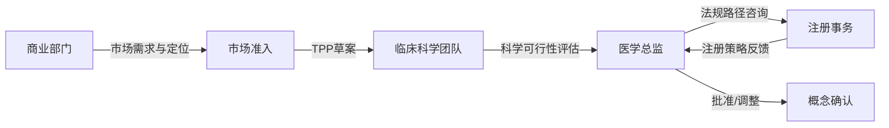
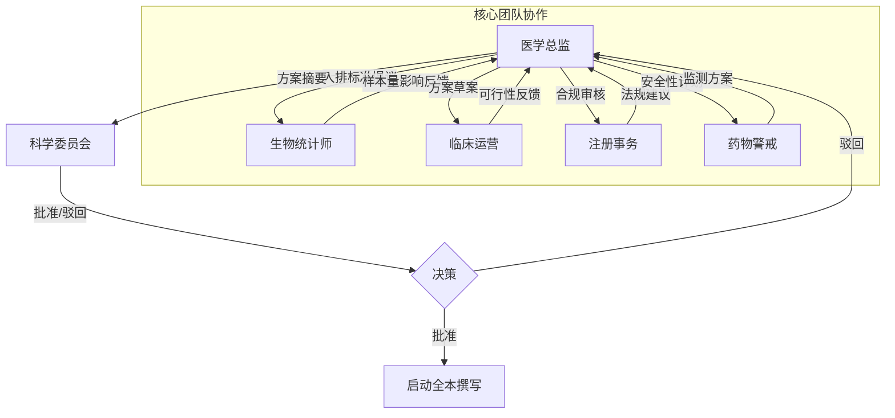
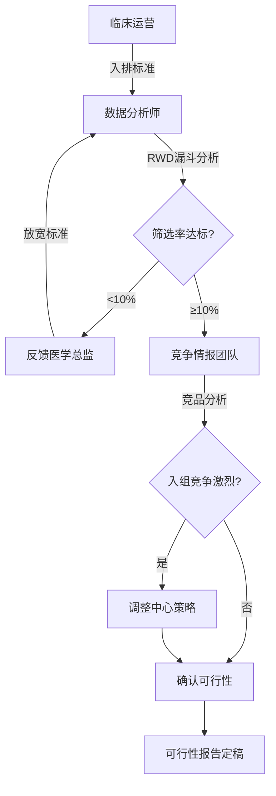
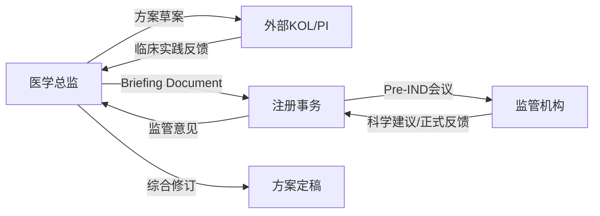
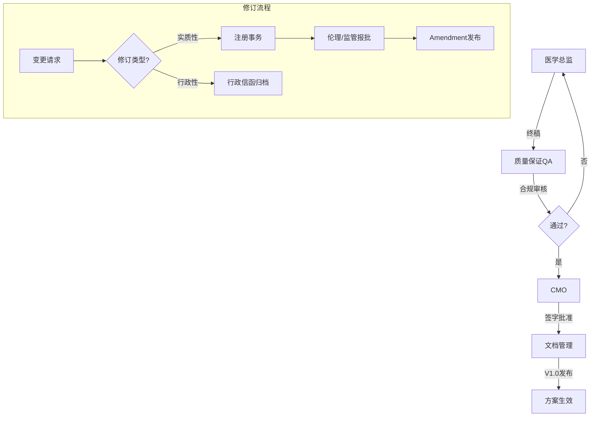
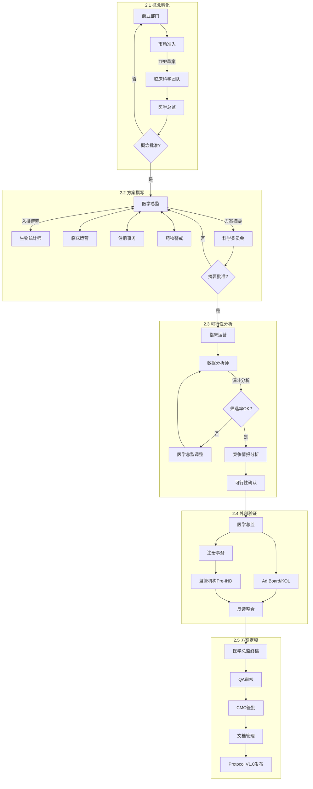

# **医药研发全景指南：肿瘤临床试验方案的构建、执行策略与外包管理深度解析报告**

## **1\. 引言：药物研发的核心蓝图**

在现代生物医药研发的复杂生态系统中，临床试验方案（Clinical Study Protocol, CSP）不仅是一份科学实验的设计说明书，更是连接科学假设与上市许可之间的法律契约、伦理承诺与操作指南。对于制药企业（Sponsor）而言，一份高质量的临床方案是数亿美元研发投入的基石；对于合同研究组织（CRO）而言，它是评估项目可行性与成本的唯一依据；对于监管机构（如FDA、NMPA、EMA）而言，它是审评药品获益-风险比的核心文件。

本报告将以**胃癌（Gastric Cancer）**——这一具有高度异质性且东西方流行病学差异显著的瘤种为例，对临床方案的解剖学结构进行详尽的微观解析。同时，报告将跳出单纯的文件层面，深入剖析药企内部形成这一方案的动态工作流（Workflow），揭示跨职能团队如何在数据驱动下进行决策与协调。最后，我们将视角转向商业化执行，详细解读药企向CRO发出的建议书征询文件（Request for Proposal, RFP）及报价网格（Bid Grid）的构建逻辑，为行业从业者提供一份从科学设计到商业落地的全景式指南。

## ---

**第一部分：肿瘤临床试验方案的深度解剖——以胃癌为例**

临床试验方案的结构并非随意堆砌，而是受到国际人用药品注册技术协调会（ICH）发布的E6(R3)《药物临床试验质量管理规范》的严格约束 1。在胃癌领域，由于生物标志物（如HER2, CLDN18.2, PD-L1）的广泛应用和复杂的联合治疗模式，方案的复杂性呈指数级上升。

### **1.1 方案的行政与身份信息（General Information）**

方案的开篇不仅是形式主义的展示，更是明确法律责任归属的关键。

#### **1.1.1 标题的科学逻辑**

一个标准的肿瘤临床试验标题必须包含设计要素（Design Elements）、研究人群（Population）、干预措施（Intervention）和对照（Comparator）。例如：“一项评价Zolbetuximab联合mFOLFOX6对比安慰剂联合mFOLFOX6一线治疗CLDN18.2阳性、HER2阴性局部晚期不可切除或转移性胃及胃食管结合部腺癌的随机、双盲、III期临床研究（SPOTLIGHT研究）” 3。

* **深层洞察**：标题中的每一个限定词都对应着巨大的筛选成本和市场定位。例如“CLDN18.2阳性”意味着必须预筛大量患者，而“一线治疗”则界定了其在治疗路径中的核心地位。

#### **1.1.2 责任主体与签字页**

方案必须列出申办方（Sponsor）、医疗监查员（Medical Monitor）、协调研究者（Coordinating Investigator）及统计学家。ICH E6要求研究者在方案签字页签字，这不仅代表知晓方案内容，更代表承诺严格遵守GCP原则，具有法律约束力 5。

### **1.2 背景信息与研究原理（Background and Rationale）**

此章节构成了试验的“立项依据”，必须构建完整的证据链，说服监管机构和伦理委员会该研究具有科学价值且伦理可接受。

#### **1.2.1 疾病负担与未满足的临床需求**

针对胃癌，方案撰写者需引用最新的流行病学数据（如Globocan），指出全球每年新增病例数及死亡率。关键在于阐述标准治疗（Standard of Care, SoC）的局限性。

* **东西方差异的考量**：报告需明确指出，胃癌在亚洲（特别是中日韩）与西方国家在病因学、病理亚型（肠型 vs 弥漫型）及预后上的显著差异 7。例如，日本患者预后通常好于西方，这在设计全球多中心试验时，直接影响分层因素的设定。  
* **治疗现状**：描述目前一线治疗以氟尿嘧啶类联合铂类为主（如FOLFOX或CAPOX），HER2阳性患者加用曲妥珠单抗，PD-L1高表达患者加用免疫检查点抑制剂（ICI）。必须指出在特定亚群（如HER2阴性/CLDN18.2阳性）中缺乏靶向治疗手段，从而引出试验药物的定位 8。

#### **1.2.2 试验药物特征与机制**

详细阐述药物的作用机制（MOA）。

* **案例分析**：对于靶向CLDN18.2的单抗，需解释其如何特异性结合胃黏膜紧密连接蛋白，并通过抗体依赖性细胞毒性（ADCC）和补体依赖性细胞毒性（CDC）杀伤肿瘤细胞 10。  
* **剂量选择依据**：必须引用I/II期研究数据（如PK/PD模型、最大耐受剂量MTD、推荐的II期剂量RP2D），证明拟定剂量（如800mg/m2首剂，后续600mg/m2 q3w）在安全性与疗效之间的最佳平衡 11。

### **1.3 试验目标与终点设计（Objectives and Endpoints）**

这是方案的核心骨架，直接决定了统计学假设和样本量。

#### **1.3.1 主要目标与终点（Primary Endpoint）**

在晚期胃癌III期研究中，主要终点通常是总生存期（OS）或无进展生存期（PFS）。

* **双主要终点策略**：如CheckMate 649研究，设定了“OS”和“PFS”在PD-L1 CPS≥5人群中的双主要终点 8。这种设计虽然增加了统计学检验的多重性调整难度（需采用α消耗函数），但提高了试验成功的概率——只要其中一个终点达到统计学显著，即可支持获批。  
* **终点评估标准**：必须明确遵循RECIST 1.1标准。对于胃癌，特别需要注意“可测量病灶”的定义，因为胃壁增厚本身往往被视为不可测量病灶，除非在CT上特定条件下满足尺寸要求（如长径≥10mm且CT层厚≤5mm）12。

#### **1.3.2 次要与探索性终点**

* **次要终点**：客观缓解率（ORR）、缓解持续时间（DoR）、疾病控制率（DCR）。  
* **生活质量（QoL）**：使用EORTC QLQ-C30及胃癌特异性模块QLQ-STO22问卷，评估吞咽困难、疼痛等症状的改善 7。  
* **探索性终点**：包括生物标志物分析（如循环肿瘤DNA, ctDNA的动态变化）及免疫原性（ADA）检测。

### **1.4 试验设计（Study Design）**

#### **1.4.1 研究架构**

描述研究的总体类型，如“多中心、随机、双盲、安慰剂对照、平行组设计”。

* **随机化与分层（Stratification）**：这是消除偏倚的关键。胃癌试验的典型分层因素包括：  
  1. **地区**：亚洲（日本、韩国、中国） vs 世界其他地区（欧美）。这是为了平衡种族差异对PK和预后的影响 4。  
  2. **既往胃切除史**：全胃切除 vs 次全胃切除 vs 未切除，影响药物吸收和营养状态。  
  3. **ECOG评分**：0 vs 1。  
  4. **转移部位数量**：≤2 vs \>2。

#### **1.4.2 盲法与揭盲**

详细规定双盲的具体操作。由于化疗药物（如奥沙利铂）具有明显的副作用（如神经毒性），维持盲态极具挑战。方案可能规定由非盲药剂师配药，使用遮光输液袋，或者仅对试验药（如单抗）设盲，而化疗部分开放 14。

### **1.5 研究人群（Study Population）**

入选和排除标准是调节患者异质性与入组速度的阀门。

#### **1.5.1 入选标准（Inclusion Criteria）**

1. **知情同意**：签署ICF。  
2. **确诊**：组织学确认的腺癌。  
3. **生物标志物状态**：这是现代胃癌试验的关键。例如，必须提供足够的肿瘤组织供中心实验室检测HER2或CLDN18.2状态。方案需明确“中心实验室检测结果为准”，即使本地结果阳性也需复核 15。  
4. **可测量病灶**：根据RECIST 1.1，至少有一个可测量病灶。  
5. **器官功能**：骨髓（ANC≥1.5×10^9/L）、肝（AST/ALT≤2.5×ULN，有肝转移时可放宽至5×ULN）、肾（肌酐清除率≥30-50 mL/min）17。

#### **1.5.2 排除标准（Exclusion Criteria）**

1. **既往治疗**：如既往接受过同类靶点药物。  
2. **特殊的胃肠道状况**：对于口服药（如S-1或口服TKI），必须排除有完全性胃肠梗阻、活动性消化道出血或吸收障碍综合征的患者 18。  
3. **腹膜转移**：大量腹水通常被排除，因为腹水不仅难以测量疗效，还可能通过“第三间隙效应”影响药物的药代动力学分布，且此类患者预后极差，易干扰OS结果。  
4. **周围神经病变**：对于含奥沙利铂的方案，通常排除基线\>1级的周围神经病变患者 18。

### **1.6 治疗方案（Study Treatment）**

#### **1.6.1 给药方案**

详细列出试验药和对照药的剂型、剂量、给药途径和频率。

* **mFOLFOX6方案**：奥沙利铂 85 mg/m2 IV，亚叶酸钙 400 mg/m2 IV，5-FU 400 mg/m2 推注，随后 2400 mg/m2 持续输注46小时，每2周一次 11。  
* **联合用药时序**：明确单抗是在化疗前还是化疗后输注，以及输注速度的递增规则（如首次90分钟，若耐受良好后续可缩短至30分钟）。

#### **1.6.2 剂量调整与毒性管理**

方案必须包含详尽的剂量调整算法（Dose Modification Algorithm）。

* **血液学毒性**：如出现4级中性粒细胞减少，需暂停给药直至恢复至≤2级，并下调剂量一级（如从85降至65 mg/m2）。  
* **永久停药标准**：如发生特定的输注反应或间质性肺病（ILD，常见于ADC药物），必须永久停药 19。

### **1.7 研究评估流程（Schedule of Assessments）**

这是操作层面的核心，通常以“时间与事件表”（Time and Events Table）呈现。

| 访视阶段           | 筛选期 (D-28 to D-1) | 基线 (D1)    | 治疗期 (C1D1, C1D15...) | 治疗结束 (EOT) | 安全性随访 (EOT+30d) | 生存随访 (每3月) |
| :----------------- | :------------------- | :----------- | :---------------------- | :------------- | :------------------- | :--------------- |
| **知情同意**       | X                    |              |                         |                |                      |                  |
| **入排标准核查**   | X                    | X            |                         |                |                      |                  |
| **既往病史**       | X                    |              |                         |                |                      |                  |
| **体格检查/ECOG**  | X                    | X            | X                       | X              | X                    |                  |
| **肿瘤影像评估**   | X (基线)             |              | 每6-8周一次             | X              |                      |                  |
| **中心实验室采样** | X (HER2/CLDN18.2)    |              |                         |                |                      |                  |
| **药代动力学(PK)** |                      | X (给药前后) | X                       |                |                      |                  |
| **生存状态查询**   |                      |              |                         |                |                      | X                |

* **数据洞察**：访视的密度直接决定了CRO的报价。过于频繁的访视会增加预算和患者负担，过稀则可能漏掉安全性信号。

### **1.8 统计学分析计划（Statistical Analysis Plan, SAP）**

#### **1.8.1 样本量计算假设**

方案需明确计算依据：“假设对照组中位OS为11个月，试验组为14个月（HR=0.79），在单侧α=0.025水平下，需要观察到380个死亡事件以达到80%的把握度（Power）。考虑到10%的脱落率，计划入组550例。” 20。

#### **1.8.2 分析人群定义**

* **意向性治疗人群（ITT）**：所有随机化的患者，无论是否接受治疗。主要疗效分析通常基于ITT。  
* **安全性人群（Safety Population）**：所有接受过至少一剂药物治疗的患者。  
* **符合方案人群（PP）**：在ITT基础上，排除了重大方案违背（如依从性\<80%）的患者。

#### **1.8.3 期中分析（Interim Analysis）**

为了伦理和成本，通常设置期中分析。

* **无效性分析（Futility）**：若试验药在早期表现极差（如HR\>1.0），独立数据监察委员会（IDMC）可建议提前终止试验。  
* **优效性分析（Efficacy）**：若疗效极其显著（如P\<0.001），可提前申报上市 21。

## ---

**第二部分：临床方案形成的动态工作流与协调机制**

一个成熟的临床方案并非闭门造车，而是历时3-6个月，经过跨职能团队的激烈博弈与外部数据验证的产物。

### **2.1 概念孵化阶段（Concept Phase）**

#### **参与角色与职责**

| 角色                                 | 职责                               | 决策权         |
| ------------------------------------ | ---------------------------------- | -------------- |
| **市场准入（Market Access）**        | 分析市场机会、定价策略、支付方需求 | 商业价值定位   |
| **商业部门（Commercial）**           | 竞品分析、目标市场规模、上市策略   | 商业可行性判断 |
| **临床科学团队（Clinical Science）** | 将商业目标转化为科学设计需求       | 科学可行性评估 |
| **医学总监（Medical Director）**     | 审核科学逻辑、确认临床价值         | 概念批准       |
| **注册事务（Regulatory Affairs）**   | 评估监管路径、法规要求             | 注册策略建议   |

#### **输入/输出**

| 输入                       | 输出                          |
| -------------------------- | ----------------------------- |
| 早期临床数据（I/II期结果） | 目标产品特性文件（TPP）       |
| 市场分析报告               | 临床开发计划草案（CDP Draft） |
| 竞品情报                   | 方案概念书（Concept Sheet）   |
| 监管指南与先例             | Go/No-Go决策记录              |

#### **交互流程**

#### **2.1.1 目标产品特性（TPP）的牵引**

一切始于商业目标。市场准入（Market Access）和商业部门会制定“目标产品特性”（TPP），明确药物若要上市所需的最低疗效门槛（如“优于曲妥珠单抗”）和理想标签（Label）。临床科学团队（Clinical Science）必须设计方案来验证这一TPP。

#### **2.1.2 临床开发计划（CDP）的定位**

方案是CDP拼图中的一块。团队需确认：这是一个概念验证（PoC）研究，还是注册性关键（Pivotal）研究？如果是后者，是否需要桥接研究（Bridging Study）来支持亚洲数据？6。

### **2.2 方案撰写与内部协调（Drafting & Internal Coordination）**

#### **参与角色与职责**

| 角色                                   | 职责                           | 决策权           |
| -------------------------------------- | ------------------------------ | ---------------- |
| **医学总监（Medical Director）**       | 科学内容设计、医疗逻辑把控     | 科学设计最终决策 |
| **生物统计师（Biostatistician）**      | 样本量计算、终点定义、统计假设 | 统计方法选择     |
| **临床运营（Clinical Operations）**    | 方案可执行性评估、资源规划     | 运营可行性判断   |
| **注册事务（Regulatory Affairs）**     | 法规合规审核、监管沟通准备     | 法规风险评估     |
| **药物警戒（Pharmacovigilance）**      | 安全性监测计划设计             | 安全性策略       |
| **科学委员会（Scientific Committee）** | 高层评审、战略决策             | 方案摘要批准     |

#### **输入/输出**

| 输入                        | 输出                          |
| --------------------------- | ----------------------------- |
| 方案概念书（Concept Sheet） | 方案摘要 V0.1（Synopsis）     |
| TPP文件                     | 入选/排除标准草案             |
| 早期临床数据包              | 终点设计文件                  |
| 监管指南                    | 统计分析计划草案（SAP Draft） |
| 竞品方案参考                | 科学委员会评审记录            |

#### **交互流程**

#### **2.2.1 核心团队（Core Team）的组建**

药企会组建一个跨职能核心团队（Clinical Trial Team, CTT），包括：

* **医学总监（Medical Director）**：负责科学内容和医疗逻辑，拥有最终决定权。  
* **生物统计师（Biostatistician）**：负责样本量计算、终点定义和统计假设。这是最常与医学发生冲突的角色（医学希望入排宽松，统计希望严格以减小方差）。  
* **临床运营（Clinical Operations）**：负责评估方案的可执行性（Feasibility）。  
* **注册事务（Regulatory Affairs）**：确保设计符合FDA/CDE法规，避免“设计性拒收”。  
* **药物警戒（PV）**：负责安全性监测计划。

#### **2.2.2 方案摘要（Synopsis）的迭代**

团队首先起草5-10页的方案摘要。这是内部审批的关键节点。只有摘要通过高层科学委员会（Scientific Committee）批准，才会启动全本方案撰写 23。

### **2.3 数据驱动的可行性分析（Data-Driven Feasibility）**

#### **参与角色与职责**

| 角色                                | 职责                         | 决策权             |
| ----------------------------------- | ---------------------------- | ------------------ |
| **临床运营（Clinical Operations）** | 主导可行性分析、协调数据资源 | 入组预测与中心规划 |
| **医学总监（Medical Director）**    | 审核入排标准调整的科学合理性 | 标准放宽/收紧决策  |
| **生物统计师（Biostatistician）**   | 患者筛选率建模、统计验证     | 样本量调整         |
| **数据分析师（Data Analyst）**      | RWD数据库查询、漏斗分析执行  | 数据解读           |
| **竞争情报团队（CI Team）**         | 竞品试验监测、入组竞争分析   | 竞争策略建议       |

#### **输入/输出**

| 输入                             | 输出                   |
| -------------------------------- | ---------------------- |
| 方案摘要（入排标准草案）         | 可行性分析报告         |
| RWD数据库（TriNetX、IQVIA、EMR） | 患者漏斗分析结果       |
| ClinicalTrials.gov竞品数据       | 竞争格局分析报告       |
| 历史试验入组数据                 | 入排标准调整建议       |
| 中心调研问卷                     | 目标中心清单与入组预测 |

#### **交互流程**

在“拍脑袋”定标准的时代已成过去，现代药企利用大数据进行精细化验证。

#### **2.3.1 真实世界数据（RWD）的“漏斗分析”**

利用TriNetX、IQVIA或医院EMR脱敏数据库，模拟入排标准。

* *第一层*：筛选“胃腺癌” \+ “IV期”。  
* *第二层*：增加“HER2阴性”。  
* *第三层*：增加“既往一线化疗失败”。  
* *第四层*：增加“血小板 \> 100” \+ “无腹水”。  
* **结果分析**：如果发现第四层筛选后，符合条件的患者仅剩5%，运营团队会通过数据迫使医学团队放宽标准（如允许少量腹水或血小板\>75），否则试验将无法在预定时间内完成入组 25。

#### **2.3.2 竞争格局分析（Competitive Landscape）**

通过Citeline或ClinicalTrials.gov，分析全球正在进行的同类试验。如果发现同一时间有5个针对CLDN18.2的III期试验在招募，团队必须调整中心选择策略（避开拥挤区域）或优化方案设计（减少访视负担）以争夺患者资源 27。

### **2.4 外部验证与咨询（External Validation）**

#### **参与角色与职责**

| 角色                                     | 职责                              | 决策权       |
| ---------------------------------------- | --------------------------------- | ------------ |
| **医学总监（Medical Director）**         | 主持Ad Board、综合外部意见        | 方案调整决策 |
| **注册事务（Regulatory Affairs）**       | 准备监管沟通材料、参与Pre-IND会议 | 注册策略确认 |
| **外部KOL/PI（Principal Investigator）** | 提供临床实践视角、评估方案可行性  | 咨询建议     |
| **监管机构（FDA/EMA/CDE）**              | 审评方案设计、反馈科学建议        | 法规指导     |
| **临床科学团队（Clinical Science）**     | 记录反馈、整合修改建议            | 方案修订执行 |

#### **输入/输出**

| 输入                      | 输出                                |
| ------------------------- | ----------------------------------- |
| 方案摘要/全本草案         | 专家反馈汇总报告                    |
| 可行性分析报告            | 监管沟通会议纪要                    |
| 监管机构指南文件          | 终点设计确认函                      |
| 竞品方案参考              | 方案修订建议清单                    |
| Pre-IND Briefing Document | 监管机构正式反馈（Official Advice） |

#### **交互流程**

#### **2.4.1 专家顾问委员会（Advisory Board）**

邀请全球顶级PI（Principal Investigator）召开Ad Board会议。

* **咨询点**：对照药在不同国家的接受度（如欧美医生是否接受S-1作为对照？）；生物标志物检测的实操难度（如活检组织的质量要求）28。

#### **2.4.2 监管机构咨询（Pre-IND / Scientific Advice）**

对于关键研究，药企会在方案定稿前与FDA（Type B meeting）、EMA或CDE进行正式沟通。获取监管机构对主要终点选择和统计分析计划的背书，是降低研发风险的“黄金护身符”。

### **2.5 方案定稿与修订管理**

#### **参与角色与职责**

| 角色                               | 职责                       | 决策权       |
| ---------------------------------- | -------------------------- | ------------ |
| **首席医学官（CMO）**              | 最终审批签字、承担科学责任 | 方案发布批准 |
| **医学总监（Medical Director）**   | 整合所有反馈、完成终稿     | 内容定稿     |
| **质量保证（QA）**                 | 格式审核、GCP合规检查      | 质量放行     |
| **文档管理（Document Control）**   | 版本控制、归档分发         | 文档管理     |
| **注册事务（Regulatory Affairs）** | 修订类型判定、监管报批     | 修订策略     |
| **伦理委员会（IRB/EC）**           | 审核实质性修订             | 伦理批准     |

#### **输入/输出**

| 输入             | 输出                              |
| ---------------- | --------------------------------- |
| 方案终稿草案     | Protocol V1.0（正式版）           |
| 外部反馈汇总     | CMO签字页                         |
| 质量审核清单     | 版本发布通知                      |
| 执行期间变更请求 | 方案修订（Amendment）             |
| 监管/伦理反馈    | 行政信函（Administrative Letter） |

#### **交互流程**

方案经CMO签字后生效（Version 1.0）。但在执行中，常需进行修订（Amendment）。

* **实质性修订（Substantial Amendment）**：如增加样本量、变更主要终点、增加侵入性操作。这需要重新报批伦理和监管机构 29。  
* **行政性修订（Administrative Change）**：如更新联系人电话，无需报批，通常以“行政信函”（Administrative Letter）形式归档 31。

### **2.6 阶段汇总：角色矩阵与全流程视图**

#### **2.6.1 完整角色清单与职责矩阵**

| 角色类别         | 角色名称                           | 核心职责                                 | 参与阶段     |
| ---------------- | ---------------------------------- | ---------------------------------------- | ------------ |
| **药企核心团队** | 医学总监（Medical Director）       | 科学内容设计、医疗逻辑把控、最终科学决策 | 全流程       |
|                  | 生物统计师（Biostatistician）      | 样本量计算、终点定义、统计分析           | 2.2/2.3/定稿 |
|                  | 临床运营（Clinical Operations）    | 可行性评估、中心选择、资源规划           | 2.2/2.3/执行 |
|                  | 注册事务（Regulatory Affairs）     | 法规合规、监管沟通、申报材料             | 全流程       |
|                  | 药物警戒（Pharmacovigilance）      | 安全性监测计划、AE/SAE管理               | 2.2/执行     |
|                  | 市场准入（Market Access）          | 市场机会分析、定价策略                   | 2.1          |
|                  | 商业部门（Commercial）             | 竞品分析、上市策略                       | 2.1          |
|                  | 临床科学团队（Clinical Science）   | 商业目标转化为科学设计                   | 2.1/2.2      |
|                  | 采购部门（Procurement）            | CRO选型、合同谈判、成本控制              | 外包阶段     |
| **高层决策**     | 首席医学官（CMO）                  | 方案最终审批、科学责任承担               | 2.5          |
|                  | 科学委员会（Scientific Committee） | 战略评审、方案摘要批准                   | 2.2          |
| **支持职能**     | 数据分析师（Data Analyst）         | RWD查询、漏斗分析                        | 2.3          |
|                  | 竞争情报团队（CI Team）            | 竞品监测、入组竞争分析                   | 2.3          |
|                  | 质量保证（QA）                     | 格式审核、GCP合规检查                    | 2.5          |
|                  | 文档管理（Document Control）       | 版本控制、归档分发                       | 2.5          |
| **外部角色**     | 外部KOL/PI                         | 临床实践视角、方案可行性评估             | 2.4          |
|                  | 监管机构（FDA/EMA/CDE）            | 方案审评、科学建议                       | 2.4/申报     |
|                  | 伦理委员会（IRB/EC）               | 伦理审查、受试者保护                     | 2.5/执行     |

#### **2.6.2 阶段输入/输出汇总**

| 阶段               | 输入                                        | 核心活动                     | 输出                                     | 关键决策点     |
| ------------------ | ------------------------------------------- | ---------------------------- | ---------------------------------------- | -------------- |
| **2.1 概念孵化**   | 早期临床数据、市场分析、竞品情报、监管指南  | TPP制定、CDP定位             | TPP文件、CDP草案、概念书、Go/No-Go记录   | 概念批准       |
| **2.2 方案撰写**   | 概念书、TPP、临床数据包、监管指南           | 摘要撰写、入排设计、终点定义 | 方案摘要V0.1、入排标准草案、SAP草案      | 科学委员会审批 |
| **2.3 可行性分析** | 方案摘要、RWD数据库、竞品数据、历史入组数据 | 漏斗分析、竞争格局分析       | 可行性报告、入排调整建议、目标中心清单   | 入排标准确认   |
| **2.4 外部验证**   | 方案草案、可行性报告、监管指南              | Ad Board、Pre-IND会议        | 专家反馈报告、监管正式反馈、修订建议清单 | 终点设计确认   |
| **2.5 方案定稿**   | 方案终稿草案、外部反馈、质量审核清单        | 质量审核、CMO签批            | Protocol V1.0、签字页、发布通知          | 方案冻结发布   |

#### **2.6.3 端到端协作流程图**

#### **2.6.4 角色间关键协作关系**

| 协作对                | 协作内容             | 典型冲突点                                        | 解决机制            |
| --------------------- | -------------------- | ------------------------------------------------- | ------------------- |
| 医学总监 ↔ 生物统计师 | 入排标准与样本量     | 医学希望宽松（易入组）vs 统计希望严格（减少方差） | 可行性数据驱动决策  |
| 医学总监 ↔ 临床运营   | 方案复杂度与执行难度 | 科学完美 vs 运营可行                              | RWD漏斗分析验证     |
| 医学总监 ↔ 注册事务   | 创新设计与合规要求   | 突破性设计 vs 监管接受度                          | Pre-IND沟通获取背书 |
| 临床运营 ↔ 采购部门   | CRO选择与预算控制    | 能力优先 vs 成本优先                              | Bid Defense综合评估 |
| 药企 ↔ CRO            | 工作范围与责任边界   | 任务模糊导致变更订单                              | 清晰SoW与RACI矩阵   |

## ---

**第三部分：药企致CRO的项目初始需求文档（RFP Package）深度解析**

当药企决定将试验外包给CRO时，需将上述科学方案转化为商业需求。这一过程的核心载体是建议书征询文件（RFP）。

### **3.1 RFP文件包的构成：不仅仅是方案**

一个标准的RFP文件包（RFP Package）通常是一个包含多个文件的压缩包，其完整性直接决定了CRO报价的准确性 32。

1. **RFP邀请函（Cover Letter）**：规定投标截止时间、提问（Q\&A）截止时间、竞标防御会议（Bid Defense）的预定日期。  
2. **临床方案摘要（Protocol Synopsis）**：由于全本方案可能保密或未定稿，摘要是必须的。如果是双盲研究，有时会提供脱敏的摘要。  
3. **工作范围说明书（Scope of Work, SoW）**：这是最关键的法律性文件，定义了任务边界。  
4. **报价网格模板（Bid Grid / Budget Grid）**：锁定的Excel表格，要求CRO填报。  
5. **研究假设清单（Study Assumptions）**：包含了所有CRO进行数学计算所需的基础参数。

### **3.2 核心文件一：工作范围说明书（SoW）的RACI矩阵**

SoW通常采用RACI矩阵形式，详细列出数百项任务的责任归属 34。

| 任务类别       | 具体任务 (Task)            | 申办方 (Sponsor) | CRO      | 第三方供应商 (3rd Party) |
| :------------- | :------------------------- | :--------------- | :------- | :----------------------- |
| **项目管理**   | 制定项目管理计划 (PMP)     | 审批 (A)         | 负责 (R) | \-                       |
| **监管事务**   | 准备IND申请材料            | 负责 (R)         | 协助 (S) | \-                       |
| **监管事务**   | 当地伦理委员会递交         | \-               | 负责 (R) | \-                       |
| **数据管理**   | 数据库构建 (EDC Build)     | 审批 (A)         | 负责 (R) | \-                       |
| **药物供应**   | 试验药品的包装与贴签       | 负责 (R)         | \-       | 可能会委托专门的包装商   |
| **药物供应**   | 药品运输至中心 (Logistics) | \-               | 负责 (R) | \-                       |
| **中心实验室** | 样本检测试剂盒提供         | \-               | 协调 (C) | 负责 (R) (如Covance/Q2)  |

* **深层洞察**：清晰的SoW能防止项目后期的“变更订单”（Change Order）风暴。例如，若未明确“严重不良事件（SAE）翻译”由谁负责，后期往往会产生巨额的额外翻译费用。

### **3.3 核心文件二：报价网格（Bid Grid）的微观结构**

Bid Grid是药企采购部门（Procurement）用来横向比价的神器。它通常包含数千个单元格，分为若干个Sheet 36。

#### **Sheet 1: 假设与参数 (Assumptions & Drivers)**

CRO必须基于这些参数计算费用。如果CRO修改了这些参数，其报价将被视为无效或需重新调整。

* **国家分布**：如“中国：20家中心，150例患者；美国：10家中心，50例患者”。  
* **招募速率**：如“0.5例/中心/月”。  
* **访视频率**：如“筛选期1次，治疗期每3周1次，随访期每3月1次”。  
* **监测策略**：如“100%源数据核对（SDV）”还是“基于风险的监查（RBM，仅核对关键数据）”。

#### **Sheet 2: 人力成本 (Labor Fees / Professional Fees)**

这是CRO利润的主要来源。每一行对应一个具体的任务（Task），每一列对应一种角色（Role）和费率（Rate）。

* **项目管理 (PM)**：通常按月计算 FTE (Full Time Equivalent)。  
* 临床监查 (CRA)：计算公式最为复杂。

  $$\\text{Total CRA Hours} \= (\\text{Selection Visits} \\times T\_1) \+ (\\text{Initiation Visits} \\times T\_2) \+ (\\text{Routine Monitoring Visits} \\times \\text{Freq} \\times \\text{Duration} \\times T\_3) \+ (\\text{Close-out Visits} \\times T\_4)$$

  其中，$T$ 代表包括路途、现场工作和报告撰写在内的总工时。  
* **数据管理 (DM)**：按CRF页数或“数据清理轮次”计费。  
* **生物统计 (Stats)**：按生成的图表（Tables, Listings, Figures \- TLFs）数量计费，如“预估制作300个TLFs”。

#### **Sheet 3: 直接转嫁成本 (Pass-Through Costs, PTC)**

这是CRO代垫代付的费用，理论上不加收利润（或仅加收少量管理费）。

* **差旅费**：CRA去医院监查的机票、酒店。  
* **会议费**：研究者会议（Investigator Meeting）的场地、餐饮费。  
* **系统费**：EDC、IWRS（交互式网络应答系统）的License费用。  
* **伦理费**：各医院伦理委员会收取的审查费。

### **3.4 核心文件三：研究假设与规格说明书 (Study Specifications)**

为了让CRO报价更精准，药企还需提供具体的技术规格。

* **IVRS/IWRS规格**：是否需要管理药物库存？是否需要进行复杂的动态随机化？  
* **EDC规格**：预计有多少个eCRF页面？是否需要整合外部数据（如中心实验室数据导入）？  
* **医学监查计划**：是否需要CRO的医学团队提供24/7的紧急热线服务？

### **3.5 竞标防御会议（Bid Defense Meeting, BDM）**

收到各家CRO的Proposal和Bid Grid后，药企会筛选出2-3家Finalists进行BDM。

* **会议目的**：除了压价，更重要的是“面试”项目团队。药企会要求拟定的项目经理（PM）和核心CRA出席。  
* **典型挑战问题**：  
  * “你们在Bid Grid中假设中国区启动只需要4个月，但根据遗传办（HGRAC）的最新审批速度，这是否过于乐观？”  
  * “你们如何应对胃癌患者常见的营养不良导致的脱落率？有什么具体的患者保留策略？” 38。

## ---

**第四部分：结论与前瞻**

### **4.1 方案质量决定成败**

临床试验方案是整个药物研发大厦的地基。一个设计拙劣的方案——例如选择了错误的对照组、设定了不切实际的入排标准或忽视了东西方人群的异质性——将直接导致试验失败，无论后续的执行（CRO运营）多么完美都无法挽回。

### **4.2 数据驱动决策的常态化**

从方案的可行性分析（Feasibility）到CRO的选择，药企正越来越依赖数据而非经验。利用真实世界数据（RWD）精准定位患者分布，利用历史运营数据校准CRO的报价模型，已成为行业标准操作。

### **4.3 战略性外包关系的演变**

RFP和Bid Grid不再仅仅是采购工具，而是战略协同的载体。药企通过详尽的RFP传达其科学愿景，CRO通过专业的Proposal展示其执行智慧。在未来，双方在方案设计阶段的早期介入（Early Engagement）将成为趋势，共同规避风险，加速新药上市进程。

通过对从方案科学构建到商业外包落地的全链路解析，我们可以看到，成功的临床试验是严谨科学、精细管理与商业智慧的完美结合。对于胃癌这一全球性健康挑战，只有通过这样高度专业化、标准化的协作体系，才能为患者带来真正的临床获益。

-------

## CRO 收到 RFP 后的流程

当 **CRO（合同研究组织）收到药企发出的 RFP（Request For Proposal，提案请求）** 后，从内部评估到最终提交响应，通常会经过一系列关键流程以确保提案既专业又有竞标优势。这个过程涉及跨部门协作、技术评审、成本预算、风险控制等多个环节。下面按时间顺序整理主要步骤及产出内容（内容结合行业常见实践总结）。([clinicalleader.com][1])

---

## 🧭 1. 初步评估与响应意向确认

**目标**：判断是否值得投入资源准备提案。

**关键工作＆产出**

* **评估 RFP 要求**：评审项目范围（phase、试验类型）、规模（受试者数、站点数量）、时间节点、预算范围、地域等。
* **资格和资源匹配**：确认内部现有团队、技术平台和经验是否符合申办方要求。
* **风险识别**：识别潜在主要风险，如关键地区入场难度、伦理审查延期、患者招募挑战等。
* **决定是否应标**：如果时间不够或不匹配可直接回复不参与，否则确认“Intent to Respond”（响应意向）。([clinicalleader.com][1])

**产出**：
📄 意向回复邮件/确认表；
📊 初步评估笔记（是否应标、关键差异点）。

---

## 📊 2. 项目可行性分析（Feasibility Assessment）

**目标**：深入理解项目的可执行性与风险。

**关键工作＆产出**

* **可行性调查**：内部专家会审 RFP 细节，如临床设计、入组难度、监管要求等。
* **问询与澄清**：整理需要 sponsor 澄清的问题清单（如受试者来源、数据管理要求、现场监查频次等）。
* **内部资源调配规划**：拟定是否需要外包部分资源（如中心实验室、数据管理平台等）。([clinicalleader.com][1])

**产出**：
📋 可行性评估报告；
📅 与 sponsor 的 Q&A 列表。

---

## 🧠 3. 方案设计与技术应答

**目标**：构建针对 RFP 详细的科学与执行方案。

**关键工作＆产出**

* **工作范围分解（WBS）**：详细拆分项目执行内容，如临床运营、数据管理、生物统计、安全监测等。
* **方法论和策略**：为每个任务制定执行方法、关键里程碑、质量控制机制。
* **时间规划**：绘制 Gantt 图，标出关键节点（Ethics/IRB、站点启动、首例受试者入组等）。
* **风险管理规划**：制定风险识别 + 缓解措施（例如迟滞入组的备选方案）。([IntuitionLabs][2])

**产出**：
📑 技术/执行方案章节；
📅 项目里程碑与时间表；
📊 风险管理计划。

---

## 💰 4. 成本估算与预算编制

**目标**：把技术方案用预算形式量化，确保经济可行。

**关键工作＆产出**

* **成本模型构建**：细化资源成本，包括 CRA 巡访、数据管理、药物寄送、中心实验室成本等。
* **预算分项模板**：通常按功能（监查、数据、安全、统计）和阶段划分。
* **假设条件说明**：对受试者招募率、站点数量、巡访次数等关键预算假设进行书面说明。
* **敏感性分析**：对于不确定性较高项（招募速度、监管延误）做预算敏感性说明。([clinicalleader.com][1])

**产出**：
📊 完整预算表（常以 Excel + 说明文本）；
📌 预算假设与风险说明。

---

## 🧩 5. 团队与能力证明材料准备

**目标**：展示执行团队实力和相关经验，以增强竞争力。

**关键工作＆产出**

* **指定项目团队成员**：列出 PM、临床运营主管、数据经理、生物统计师等核心人员。
* **提供 CV / 能力简介**：突出团队在类似研究、适应症的成功经验。
* **公司资质/质量体系证明**：如 GCP 认证、ISO 证书、历年审计结果等。([IntuitionLabs][2])

**产出**：
👥 团队资格表；
📄 资质与过往案例汇编。

---

## 📝 6. 提案整合与撰写

**目标**：把所有模块整合形成规范化、可阅读性强、专业的提案文档。

**典型结构**

1. **执行摘要（Executive Summary）**
   概述方案亮点与价值主张。
2. **项目理解与目标**
   展示对 RFP 要求的理解，并确认关键目标。
3. **技术与执行方案**
   详述每项服务的执行策略。
4. **时间线与里程碑**
   明确关键交付日期。
5. **预算与报价细则**
   提供清晰分项预算与总报价。
6. **团队与资质展示**
   证明执行能力与经验。
7. **风险与应对措施**
   显示项目把控能力。([clinicalleader.com][1])

**产出**：
📄 完整提案文档（PDF/PPT/Excel 预算表）。

---

## 📩 7. 内部审批与质量审核

**目标**：确保提案内容正确、可执行、合规。

**关键工作**

* **合规与法务审核**：确认不违反行业规范和合同条款；
* **高层审批**：BD/项目负责人签字认可报价与资源承诺；
* **格式与一致性检查**。

**产出**：
✔️ 最终签发版本；
✔️ 审批记录与合规证明。

---

## 📦 8. 提交与后续跟进

**目标**：按 sponsor 要求格式、时限提交，并准备沟通/答辩。

**关键工作**

* **按渠道交付**（邮件/门户/FTP）；
* **Q&A & best-and-final offers 回应**（如 sponsor 要求进一步报价调整或澄清）；
* **Bid Defense/现场答辩准备**，可能需要演示方案/时间线。([TrialHub][3])

**产出**：
📤 正式提交材料；
🧑‍💻 答辩材料/演示文稿。

---

## 📌 常见提案内容输出清单（汇总）

| 类型       | 核心产出                     |
| ---------- | ---------------------------- |
| 商务部分   | 承诺函、报价单、预算表       |
| 技术部分   | 执行方案、方法论说明、时间线 |
| 团队与能力 | CV、资质证明、案例汇编       |
| 风险与质量 | 风险应对、质量保障计划       |
| 提案支撑   | 合规文件、法律条款意见       |

---
